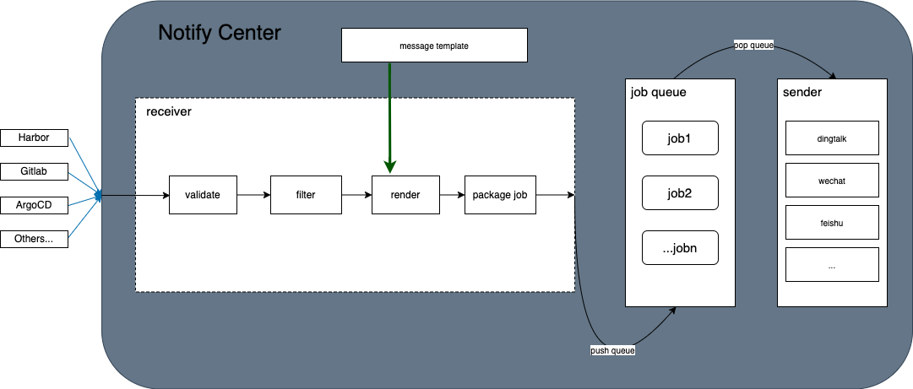

> 项目背景：用于对接 harbor 的 webhook 功能并将消息推送至到钉钉中；后为了项目的可扩展性，逐步将项目进行分层拆分，并将接入和推送服务进行解耦，方便对接不通的接入方以及推送服务。
# Notify Center

用于对接第三方 webhook 或自定义消息释出服务，并将消息体推送至外部通讯工具如钉钉的通知中心。
# 架构设计

项目组件分为三类：
* receiver：接入服务，用以接收第三方的消息体，并对消息体进行校验，过滤，渲染，封装等操作。
* job queue：用以存放不同的消息任务，实现接入服务和推送服务的解耦。
* sender: 消息推送服务，用以处理job queue中的各种推送任务。

# 可扩展性
目前项目中仅实现了钉钉 robot 作为消息推送方，消息推送服务以插件的形式注册到 sender 之中，若需要接入其他推送服务，比如 wechat，telegram等，只需要实现如下接口即可，说明如下：
1. 推送服务接口
```go
type Pusher interface {
	// push action
	Push(m cm.OutMessage) error
	// pusher type
	Type() string
}
```
推送服务需要实现以上接口，分别用于执行消息推送动作以及说明推送服务类型。

2. 推送服务消息体接口
```go
type OutMessage interface {
	RealText()
}
```

3. 推送消息模板接口
```go
type OutMessageTemplate interface {
	GetSentence() []string
}
``` 

4. 推送服务消息渲染器接口
```go
type Render interface {
	Rend(n InputMessage, omt OutMessageTemplate) (OutMessage, error)
}
```

